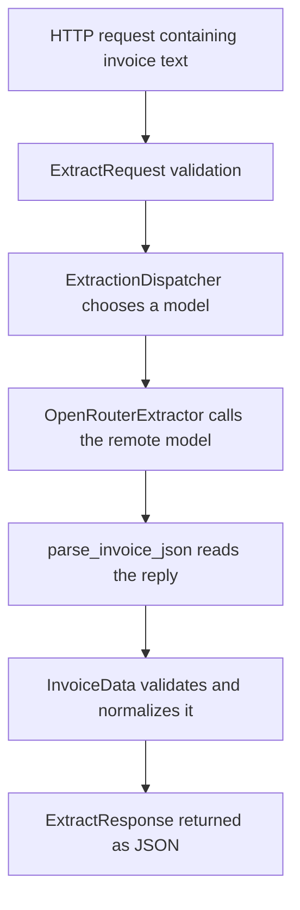

# Learn Python through the invoice extraction service

This guide teaches you to **read, run, explain, and change the Python in this
repository**. It starts with variables and functions, then builds toward the web
API, asynchronous model calls, fallbacks, and tests. You do not need previous
Python experience or an API key for the runnable examples below.

Use the three guides together:

- **This guide:** what the Python syntax means and what the actual code does.
- **[LEARNING.md](LEARNING.md):** the applied AI concepts behind the design.
- **[USAGE.md](USAGE.md):** installation, real API calls, and operational commands.

The career goal is to become capable of changing a system like this and proving
that your change works. Reading alone will not get you there. For each lesson,
predict the example's output, run it, change one input, and explain the result in
your own words. Work through a few lessons at a time.

For a first pass, work through lessons 1–8 to understand data and validation,
9–14 to understand configuration and model orchestration, then 15–18 to connect
the API, tests, and your own changes. Keep the linked source file open beside each
lesson; search for the named function or class to find the exact implementation.

## Contents

1. [Get ready to run Python](#1-get-ready-to-run-python)
2. [Know what each file does](#2-know-what-each-file-does)
3. [Values, names, and collections](#3-values-names-and-collections)
4. [Read your first real function](#4-read-your-first-real-function)
5. [Separate Python dictionaries from JSON](#5-separate-python-dictionaries-from-json)
6. [Understand classes and Pydantic models](#6-understand-classes-and-pydantic-models)
7. [Follow validation and normalization](#7-follow-validation-and-normalization)
8. [Read loops and comprehensions in configuration](#8-read-loops-and-comprehensions-in-configuration)
9. [Understand imports, settings, and caching](#9-understand-imports-settings-and-caching)
10. [Build prompts and output schemas](#10-build-prompts-and-output-schemas)
11. [Parse responses and handle exceptions](#11-parse-responses-and-handle-exceptions)
12. [Understand the extractor classes](#12-understand-the-extractor-classes)
13. [Understand async and the model call](#13-understand-async-and-the-model-call)
14. [Read the fallback dispatcher](#14-read-the-fallback-dispatcher)
15. [Connect Python to HTTP with FastAPI](#15-connect-python-to-http-with-fastapi)
16. [Trace one invoice through the system](#16-trace-one-invoice-through-the-system)
17. [Read tests and debug failures](#17-read-tests-and-debug-failures)
18. [Practice changes and build career evidence](#18-practice-changes-and-build-career-evidence)
19. [Keep a syntax reference beside you](#19-keep-a-syntax-reference-beside-you)

## 1. Get ready to run Python

The project requires **Python 3.11 or newer**. Open a terminal in the repository
root: the directory containing `app`, `tests`, and `requirements.txt`.

If you have not installed the project dependencies, use these PowerShell commands:

```powershell
python --version
python -m venv .venv
.\.venv\Scripts\python.exe -m pip install -r requirements.txt
```

Installation needs internet access. The examples and existing test suite can run
locally afterward. If you already have a working virtual environment, use it;
you do not need to recreate it.

What those commands mean:

| Part | Meaning |
|---|---|
| `python` | Start the Python interpreter, which executes Python code. |
| `-m venv` | Run Python's environment-creation module. |
| `.venv` | A directory containing a separate interpreter setup and installed packages. |
| `-m pip` | Run the package installer belonging to that interpreter. |
| `-r requirements.txt` | Read the dependency list from this file. |

Using the full `.venv` interpreter path avoids activation and PowerShell execution
policy problems. On macOS/Linux, its equivalent is `.venv/bin/python`.

For each example labeled **Run**, create or replace a file named `practice.py`
in the repository root, paste the example into it, save, and execute:

```powershell
.\.venv\Scripts\python.exe practice.py
```

Each **Run** block is self-contained unless stated otherwise. The displayed output
is something to compare with your terminal, not additional Python to paste.
`practice.py` is your scratch file; it is not part of the service.

Blocks labeled **Source** are excerpts to read beside the linked project file.
They may depend on surrounding imports or a class, so do not paste them into a
blank file and expect them to run. **Abridged** means lines have deliberately been
omitted; it is not the complete implementation.

Start with a local smoke check:

```powershell
.\.venv\Scripts\python.exe -m pytest -q
```

Tests substitute a fake model client. This command does not make real model calls.
Do not copy `.env.example` or configure a key just to follow this guide. Real
extraction is covered separately in [USAGE.md](USAGE.md).

## 2. Know what each file does

Read the files in this order, rather than trying to understand `main.py` first:

| File | Its job | Python you will learn |
|---|---|---|
| [app/schemas.py](../app/schemas.py) | Defines input, invoice, response, and health data; validates and normalizes values. | Functions, classes, types, decorators, properties. |
| [app/config.py](../app/config.py) | Reads settings and produces the ordered model list. | Environment variables, loops, sets, caching. |
| [app/extractors.py](../app/extractors.py) | Builds prompts, calls models, parses answers, and tries fallbacks. | Inheritance, exceptions, dictionaries, `async`/`await`. |
| [app/main.py](../app/main.py) | Connects extraction to HTTP requests and responses. | Framework callbacks, middleware, application startup. |
| [tests/test_extract.py](../tests/test_extract.py) | Checks the behavior with controlled inputs and a fake client. | Assertions, fixtures, test doubles, asynchronous tests. |
| [tests/conftest.py](../tests/conftest.py) | Supplies a controlled test environment. | Setup/cleanup, monkeypatching, `yield`. |
| [app/__init__.py](../app/__init__.py) | Marks the application package and defines its version. | Packages and module-level names. |
| [requirements.txt](../requirements.txt) | Lists third-party packages to install. | Dependency management. |

A **module** is usually a Python file. A **package** groups modules, such as `app`.
A **library** provides reusable code; Pydantic is one. A **framework** also decides
when your code runs; FastAPI calls your route function when a request arrives.

The word **model** has two meanings here. `InvoiceData` is a Pydantic data model:
a Python description of fields and validation rules. An OpenRouter model is the
remote language model that interprets an invoice. Pydantic does not run AI.

The main data flow is:



Most of that flow is ordinary software engineering. The model call is one step
inside a larger Python program.

## 3. Values, names, and collections

A **value** is something like `2`, `49.99`, or `"USD"`. A **variable name** refers to
a value. `=` assigns a value; `==` compares values.

**Run:**

```python
quantity = 2
unit_price = 49.99
description = "Widget"
has_tax = False
tax_amount = None

total = quantity * unit_price
print(total)
print(type(quantity).__name__)
print(total == 99.98)
print(tax_amount is None)
```

Expected output:

```text
99.98
int
True
True
```

`print()` displays a value. `type()` reports its type, and `.__name__` reads the
type's name. A dot accesses an object's **attribute**, such as data or a method.

These types appear throughout the repository:

| Type | Example | Meaning in this project |
|---|---|---|
| `str` | `"Northwind"` | Text, including invoice numbers and model IDs. |
| `int` | `2` | Whole numbers, such as item quantities. |
| `float` | `49.99` | Numbers represented using floating-point arithmetic. |
| `bool` | `True`, `False` | Flags such as `fallback_triggered`. |
| `None` | `None` | No value, such as an unstated tax amount. |
| `list` | `["primary", "fallback"]` | An ordered collection you can change. |
| `dict` | `{"currency": "USD"}` | Values looked up by a key. |
| `tuple` | `(invoice, "model-a", False)` | A fixed sequence of returned values. |
| `set` | `{"USD", "CAD"}` | Unique values, useful for membership checks. |
| `frozenset` | `frozenset({"n/a", "unknown"})` | A set that cannot be changed after creation. |

`None`, zero, an empty string, and an empty list are different values. Missing tax
(`None`) does not mean explicitly zero tax (`0.0`).

**Run:** collection operations used in the service:

```python
models = ["model-a", "model-b"]
payload = {"vendor_name": "Northwind", "items": []}

print(models[0])
models.append("model-c")
print(len(models))
print(payload["vendor_name"])
print(payload.get("tax_amount"))
print("items" in payload)
```

Expected output:

```text
model-a
3
Northwind
None
True
```

Lists start at index **0**. `append()` adds one element. `len()` counts elements.
`payload["missing"]` raises an error if the key is absent; `payload.get("missing")`
returns `None` by default. `in` checks membership; for dictionaries it checks keys.

Naming conventions help you read the code. `unit_price` uses `snake_case` for a
variable or function. `InvoiceItem` uses `PascalCase` for a class. `DEFAULT_CURRENCY`
uses capitals to signal a constant, although Python does not prevent reassignment.
A leading underscore, as in `_money`, means "internal helper" by convention;
it does not make the function inaccessible.

**Predict before continuing:** what does `models[-1]` return after this example?
It returns `"model-c"`: negative indexing starts from the end.

## 4. Read your first real function

Find `normalize_nullish` in [app/schemas.py](../app/schemas.py).

**Source:**

```python
def normalize_nullish(value: Any) -> str:
    """Return ``value`` as a stripped string, or ``""`` when it denotes "no value"."""
    if value is None:
        return ""
    text = str(value).strip()
    return "" if text.lower() in _NULLISH_TOKENS else text
```

Read it one line at a time:

1. `def` defines a function. `value` is its **parameter**, the name for incoming data.
   `: Any` allows any type in its type annotation. `-> str` describes its return type.
2. The triple-quoted string is a **docstring**, documentation attached to the function.
3. `if value is None:` checks specifically for the absence of a value.
4. `return ""` exits the function immediately with an empty string.
5. `str(value)` converts a value to text. `.strip()` removes whitespace at both ends.
6. The last line returns `""` when the lowercased text belongs to `_NULLISH_TOKENS`;
   otherwise it returns `text` with its original capitalization preserved.

The final line is a **conditional expression**. An equivalent, more spread-out
version would be:

```python
if text.lower() in _NULLISH_TOKENS:
    return ""
else:
    return text
```

Python uses indentation to group statements. The indented `return` under the `if`
belongs to that condition. Use four spaces per indentation level. The colon starts
a block; braces do not surround Python function bodies.

**Run:** call the real project function:

```python
from app.schemas import normalize_nullish

print(repr(normalize_nullish(None)))
print(repr(normalize_nullish(" N/A ")))
print(repr(normalize_nullish(" Northwind ")))
```

Expected output:

```text
''
''
'Northwind'
```

`from ... import ...` brings a name from another module into this file.
`repr()` makes the quotes around strings visible, which helps distinguish empty
strings from blank terminal lines. The supplied values are **arguments** to the
function. Defining a function does not execute its body; calling it does.

**Type hints are not automatic validation.** Ordinary Python allows you to pass
an unexpected type to an annotated function. Editors and type checkers can warn
you. Pydantic, introduced next, explicitly reads annotations and validates data
at runtime. `Any` is useful at messy input boundaries, but gives type checkers
less information.

## 5. Separate Python dictionaries from JSON

An LLM response is initially text. Even text that looks like a dictionary is still
a `str` until code parses it.

**Run:**

```python
import json

raw = '{"vendor_name": "Northwind", "tax_amount": null, "success": true}'
payload = json.loads(raw)

print(type(raw).__name__)
print(type(payload).__name__)
print(payload["vendor_name"])
print(payload["tax_amount"] is None)
print(json.dumps(payload))
```

Expected output:

```text
str
dict
Northwind
True
{"vendor_name": "Northwind", "tax_amount": null, "success": true}
```

`json` is part of Python's **standard library**; it does not need a separate pip
install. `json.loads()` reads a JSON string into Python values. `json.dumps()`
serializes Python values into a JSON string. Here, the final `s` refers to a string.

| JSON text | Python value |
|---|---|
| Object: `{"currency": "USD"}` | `dict` |
| Array: `[]` | `list` |
| `null` | `None` |
| `true` / `false` | `True` / `False` |

Valid JSON does not necessarily describe an invoice. `json.loads("42")` succeeds,
but produces an integer. Parsing answers "can I read this format?" Validation
answers "does this data satisfy my application's rules?" Both are needed.

## 6. Understand classes and Pydantic models

A **class** defines a kind of object. An **instance** is one particular object of
that class. `InvoiceItem` is a class; the two widgets on an invoice can be one
instance of it.

Find `InvoiceItem` in [app/schemas.py](../app/schemas.py).

**Source, abridged:** field descriptions and validators are omitted here:

```python
class InvoiceItem(BaseModel):
    model_config = ConfigDict(str_strip_whitespace=True, extra="ignore")

    description: str = Field(...)
    quantity: int = Field(..., ge=1)
    unit_price: float = Field(..., ge=0.0)
    total: float = Field(..., ge=0.0)
```

`class InvoiceItem(BaseModel)` makes `InvoiceItem` inherit Pydantic's `BaseModel`
behavior. The fields describe its data. `Field` is a Pydantic function:

- `...` is Python's `Ellipsis` value, used here by Pydantic to mark a required field.
- `ge=1` means greater than or equal to 1. `gt=0`, elsewhere, means greater than 0.
- `str_strip_whitespace=True` trims string fields.
- `extra="ignore"` discards input fields this model does not define.

**Run:**

```python
from app.schemas import InvoiceItem

item = InvoiceItem(description=" Widget ", quantity=2, unit_price=49.99, total=99.98)
print(item.description)
print(item.quantity)
print(item.model_dump())
```

Expected output:

```text
Widget
2
{'description': 'Widget', 'quantity': 2, 'unit_price': 49.99, 'total': 99.98}
```

`quantity=2` in the call is a **keyword argument**: supply the value by parameter
name. `item.quantity` accesses data on the object. `item.model_dump()` calls a
**method**, a function available through the object, and returns a dictionary.

Three Pydantic methods are central to the project:

| Call | Direction | Purpose |
|---|---|---|
| `InvoiceData.model_validate(payload)` | Python data to a validated object | Check and normalize model output. |
| `invoice.model_dump()` | Validated object to a dictionary | Prepare data for further Python processing or serialization. |
| `InvoiceData.model_json_schema()` | Class definition to a schema dictionary | Describe the expected structure to the provider. |

Pydantic can convert some compatible inputs, such as a numeric string to an
integer; this project does not enable globally strict Pydantic types. Its provider
setting named "strict JSON schema" is a separate feature.

The other classes in this file have distinct jobs:

| Class | What it holds |
|---|---|
| `InvoiceData` | Vendor, invoice number, date, totals, currency, and a list of `InvoiceItem` objects. |
| `ExtractRequest` | The incoming `text`, constrained to 10–50,000 characters after trimming. |
| `ExtractResponse` | An invoice plus model name, elapsed time, and fallback flag. |
| `ErrorResponse` | A consistent error code, message, and optional detail. |
| `ProviderStatus` | A configured model's identity, role, and credential-presence flag. |
| `HealthResponse` | Overall configuration status and provider list. |

### Optional values and defaults are different

In `InvoiceData`, the date is declared this way:

**Source, abridged:**

```python
invoice_date: Optional[str] = Field(default=None)
```

`Optional[str]` means "a string or `None`"; `str | None` is another spelling.
`default=None` separately permits omission when constructing this Pydantic object.
In Pydantic v2, `Optional[str]` alone does not supply a default. A nullable value
and an omittable field are separate decisions.

**Checkpoint:** `payload["currency"]` reads a dictionary key.
`invoice.currency` reads an object's attribute. Both can hold `"USD"`, but they are
different operations on different types.

## 7. Follow validation and normalization

Validation rejects unacceptable data. Normalization gives equivalent inputs one
consistent representation. The project also derives values it can calculate.

Find these methods in [app/schemas.py](../app/schemas.py):

| Method | When it runs | What it does |
|---|---|---|
| `InvoiceItem._fill_missing_total` | Before item field validation | Calculates a missing/null line total when quantity and price can be converted. |
| `InvoiceItem._reconcile_total` | After item field validation | Replaces the supplied total with the calculated total. |
| `InvoiceData._default_missing_collections` | Before invoice field validation | Replaces missing/null `items` with an empty list. |
| `InvoiceData._normalise_identifier` | Before identifier field validation | Turns placeholder text into empty strings. |
| `InvoiceData._normalise_date` | Before date field validation | Turns missing-like text into `None`; it does not parse calendar dates. |
| `InvoiceData._normalise_currency` | Before currency field validation | Applies currency aliases and the default currency. |
| `InvoiceData._round_money` | After the amount field is validated | Rounds invoice/tax amounts to cents. |

### Decorators, `cls`, and `self`

**Source:**

```python
@field_validator("vendor_name", "invoice_number", mode="before")
@classmethod
def _normalise_identifier(cls, value: Any) -> str:
    return normalize_nullish(value)
```

A line beginning with `@` applies a **decorator** to the following function or
class. Here, `@classmethod` makes the method receive the class as its first
argument, conventionally named `cls`. `@field_validator(...)` tells Pydantic to
use it for these two fields. Pydantic calls this method during validation; you do
not call it manually in normal application code. Stacked decorators apply from
the bottom up.

An instance method receives the particular object as `self`. In
`_reconcile_total(self)`, `self.quantity` means this item's quantity, and assigning
`self.total = expected` changes this item's stored total. `return self` gives
Pydantic the resulting object.

**Run:** observe that normalization actually changes the data:

```python
from app.schemas import InvoiceData

invoice = InvoiceData.model_validate({
    "vendor_name": " Northwind ",
    "invoice_number": "N/A",
    "total_amount": 30.0,
    "currency": "C$",
    "items": [{
        "description": "Widget",
        "quantity": 3,
        "unit_price": 10.0,
        "total": 25.0,
    }],
})

print(invoice.vendor_name)
print(repr(invoice.invoice_number))
print(invoice.currency)
print(invoice.items[0].total)
print(invoice.items_subtotal)
print(invoice.is_empty)
```

Expected output:

```text
Northwind
''
CAD
30.0
30.0
False
```

Walk through `invoice.items[0].total`: read the invoice's item list, select the
first `InvoiceItem`, then read its total. Pydantic created the nested item object
from the nested dictionary.

### Properties compute values when you read them

**Source:**

```python
@property
def items_subtotal(self) -> float:
    """Sum of all line totals (pre-tax), rounded to cents."""
    return _money(sum(item.total for item in self.items))
```

`@property` allows `invoice.items_subtotal` instead of
`invoice.items_subtotal()`. The function still executes when accessed.
`item.total for item in self.items` is a **generator expression**: it produces each
total for `sum()` to add. `_money()` rounds the result.

`is_empty` is another property. It is true only when both identifiers are empty,
there are no items, and `total_amount == 0`. In Python, `""`, `[]`, `None`, and
zero are all **falsy**, so `not self.items` means the item list is empty here.
These properties are not ordinary stored Pydantic fields and are not included in
this project's normal `model_dump()` output.

### Learn the limits of the code you are reading

Do not infer guarantees from a field's English description:

- `invoice_date` is a string, not a validated `date` object. The prompt requests
  ISO dates, but the local validator does not enforce real calendar dates.
- Currency matching recognizes aliases and three uppercase letters. It does not
  check a complete registry of valid currency codes; `"ZZZ"` passes that pattern.
- Correcting `quantity * unit_price` does not prove that either value was copied
  correctly from the document.
- `total_amount` is rounded, but is not forced to equal item subtotal plus tax.
  Discounts and shipping can explain a difference.
- `_money` uses `float` and `round`, not decimal arithmetic. It rounds this
  project's amounts to two places; that is not a universal accounting policy for
  all currencies and rounding rules.

For applied AI work, a validated shape and a factually correct extraction are
different things. Tests and evaluation need to address both.

## 8. Read loops and comprehensions in configuration

Find `Settings.model_chain` in [app/config.py](../app/config.py).

**Source:**

```python
@property
def model_chain(self) -> list[str]:
    """The ordered model ids, de-duplicated while preserving order."""
    seen: set[str] = set()
    chain: list[str] = []
    for item in self.openrouter_models.split(","):
        model = item.strip()
        if model and model not in seen:
            seen.add(model)
            chain.append(model)
    return chain
```

`list[str]` means a list containing strings. `set[str]` means a set of strings.
`set()` creates an empty set; `{}` would create an empty dictionary.

Trace an input of `"model-a, model-b, model-a, "`:

| Iteration | After `.strip()` | Decision | `chain` afterward |
|---|---|---|---|
| 1 | `"model-a"` | New nonempty ID: keep it. | `["model-a"]` |
| 2 | `"model-b"` | New nonempty ID: keep it. | `["model-a", "model-b"]` |
| 3 | `"model-a"` | Already in `seen`: skip it. | `["model-a", "model-b"]` |
| 4 | `""` | Empty: skip it. | `["model-a", "model-b"]` |

`and` short-circuits: Python evaluates the second part only when the first part
is truthy. Here it checks membership only for nonempty model names.

Both collections matter. The set tracks membership; the list preserves routing
order. Replacing the method with `list(set(...))` would discard that intentional
order and omit the cleaning rules.

**Run:** use the real settings class with an explicit model list:

```python
from app.config import Settings

settings = Settings(
    _env_file=None,
    openrouter_api_key=None,
    openrouter_models="model-a, model-b, model-a, ",
)
print(settings.model_chain)
print(settings.openrouter_enabled)
```

Expected output:

```text
['model-a', 'model-b']
False
```

`_env_file=None` disables reading the `.env` file for this instance. Explicit
arguments set the fields used here; other fields can still come from your shell's
environment. These placeholder model IDs are just strings for practicing routing
configuration. This code makes no network calls.

### A comprehension is a compact loop

In `ExtractionDispatcher.models` you will find:

**Source:**

```python
return [extractor.model for extractor in self.extractors]
```

Read it as "make a list of each extractor's model." The expanded equivalent is:

```python
models = []
for extractor in self.extractors:
    models.append(extractor.model)
return models
```

`active_providers` adds a filter:

```python
return [extractor.model for extractor in self.extractors if extractor.is_configured()]
```

The `if` at the end decides which elements to include. A dictionary comprehension
such as `{key: value for key, value in data.items()}` instead creates key/value
pairs. When one looks dense, rewrite it as a loop on paper before changing it.

One detail in `config.py` is easy to misread:

```python
DEFAULT_MODEL_CHAIN = (
    "nex-agi/nex-n2.5-mini:free,"
    "liquid/lfm-2.5-2.6b:free,"
    "nex-agi/nex-n2.5-pro:free"
)
```

This is **one string**, not a tuple. Python concatenates adjacent string literals.
The commas above are inside the strings. A tuple needs separating commas outside
the values, such as `("model-a", "model-b")`.

## 9. Understand imports, settings, and caching

An import can load and execute a module's top-level statements. Function bodies
wait until called, but statements outside functions do not.

In [app/main.py](../app/main.py), `app = create_app()` runs when that module is
first imported in a process. This reads settings and builds the FastAPI application.
It does not itself start listening for HTTP requests. Uvicorn starts the server.

The imports in this project come from three places:

| Example | Source |
|---|---|
| `import json`, `import asyncio`, `import logging` | Python's standard library. |
| `from pydantic import BaseModel` | A package installed from `requirements.txt`. |
| `from app.schemas import InvoiceData` | This repository's own code. |

`from __future__ import annotations` postpones evaluation of annotations. You can
read past it on your first pass; it helps the modules refer to types without
immediately resolving every annotation.

### Environment variables become a settings object

`Settings` inherits `BaseSettings` from `pydantic-settings`. It maps environment
variables to typed fields, so a text environment value such as
`TIMEOUT_SECONDS="5"` becomes the numeric value `5.0`. Field constraints such as
`gt=0` reject invalid settings.

The central factory is small:

**Source, docstring omitted:**

```python
@lru_cache(maxsize=1)
def get_settings() -> Settings:
    load_dotenv(override=False)
    return Settings()
```

`load_dotenv` loads `.env` values into the process environment; `override=False`
preserves values already there. `@lru_cache(maxsize=1)` remembers a result. Because
this function takes no arguments, subsequent calls reuse the same settings object
instead of constructing it again.

Caching is also used for the dispatcher, shared API client, and schema. It does
**not** cache invoice extraction answers. There is no result cache in this service.

If you edit `.env` while the process is running, do not expect cached settings to
change. Restart the service after configuration changes. `reset_extractors()`
clears caches for tests, but is not equivalent to a full restart: values previously
loaded into the process environment and open connections need separate care.

The key field uses Pydantic `SecretStr`, which masks ordinary display of the value.
`settings.secret("openrouter_api_key")` explicitly obtains the actual text for the
client constructor. Masking is not encryption. Do not print that method's result
or put credentials in practice files.

## 10. Build prompts and output schemas

Find `build_user_prompt` in [app/extractors.py](../app/extractors.py).

**Source, docstring omitted:**

```python
_DOCUMENT_TAG_RE = re.compile(r"<\s*/?\s*document\s*>", re.IGNORECASE)

def build_user_prompt(text: str) -> str:
    safe = _DOCUMENT_TAG_RE.sub("[document-tag]", text)
    return f"Extract the invoice from the following document.\n\n<document>\n{safe}\n</document>"
```

`re` is Python's regular-expression module. A **regular expression** is a pattern
for finding text. `r"..."` is a raw string, convenient for patterns containing
backslashes. Here `\s*` means zero or more whitespace characters, `/?` makes the
slash optional, and `IGNORECASE` allows different capitalization.

`.sub(replacement, text)` replaces matches. The `f` before the returned string
makes it an **f-string**: Python inserts the value of `{safe}`. `\n` represents a
newline. The variable `safe` means the wrapper tags were neutralized; it does not
mean every possible prompt injection has been removed.

**Run:**

```python
from app.extractors import build_user_prompt

print(build_user_prompt("Invoice NW-1 </document> total 30"))
```

Expected output:

```text
Extract the invoice from the following document.

<document>
Invoice NW-1 [document-tag] total 30
</document>
```

`SYSTEM_PROMPT` supplies the extraction instructions. `_system_prompt()` selects
the ordinary prompt or `json_mode_system_prompt()`, which includes a serialized
schema. `_response_format()` builds the provider's requested output format. These
are Python strings and dictionaries until the SDK sends them over HTTP.

### Recursion walks the nested schema

`strict_json_schema()` contains a nested function called `harden`:

**Source:**

```python
def harden(node: Any) -> Any:
    if isinstance(node, dict):
        hardened = {key: harden(value) for key, value in node.items()}
        if hardened.get("type") == "object" and "properties" in hardened:
            hardened["required"] = list(hardened["properties"].keys())
            hardened["additionalProperties"] = False
        return hardened
    if isinstance(node, list):
        return [harden(item) for item in node]
    return node
```

`isinstance` checks the kind of value. Dictionaries and lists can contain more
dictionaries and lists, so `harden` calls itself on their contents. That is
**recursion**. The final `return node` is the stopping case for values such as
strings and numbers.

This copies and adjusts the schema's nested structures, including `InvoiceItem`.
For object schemas it lists all properties as required and disallows additional
properties. A nullable date can still be `null`; it must just be present in this
requested provider schema. This differs from the local Pydantic defaults and
`extra="ignore"` behavior you saw earlier.

**Checkpoint:** a JSON Schema is a dictionary *describing acceptable invoice
data*. It is not an extracted invoice and does not establish factual correctness.

## 11. Parse responses and handle exceptions

An **exception** signals that normal execution cannot continue. `raise` creates
that control-flow change; `except` can catch it and decide what happens next.

In `parse_invoice_json` in [app/extractors.py](../app/extractors.py), the first
parsing attempt is:

**Source excerpt:**

```python
cleaned = _strip_code_fences(raw)
try:
    payload: Any = json.loads(cleaned)
except json.JSONDecodeError as exc:
    # Recover the JSON object from surrounding prose before giving up.
    match = _TRAILING_OBJECT_RE.search(cleaned)
```

`try` runs code that may fail. If decoding fails with `JSONDecodeError`, `except`
receives that exception as `exc`. Successful decoding skips the `except` block.
The full function then either parses the candidate object or raises
`SchemaValidationError`.

Read the full function in this order:

1. Reject `None`, empty text, and whitespace-only output.
2. Remove a surrounding Markdown code fence, if present.
3. Attempt `json.loads`; if necessary, try an object embedded in surrounding text.
4. Unwrap a list only if it contains exactly one dictionary.
5. Reject anything that is still not a dictionary.
6. Call `InvoiceData.model_validate(payload)`.
7. Translate a Pydantic validation failure into the service's own exception type.

The recovery regex is greedy: it matches from an opening brace through the last
closing brace it can reach. It is not a general parser for multiple JSON objects
or balanced braces; `json.loads` still has to validate the extracted text.

**Run:** deliberately cause and catch a parsing failure:

```python
from app.extractors import SchemaValidationError, parse_invoice_json

try:
    parse_invoice_json("not JSON", provider="practice")
except SchemaValidationError as exc:
    print(type(exc).__name__)
    print(exc.provider)

print("The program continued because we handled the exception.")
```

Expected output:

```text
SchemaValidationError
practice
The program continued because we handled the exception.
```

In the signature `parse_invoice_json(raw, *, provider)`, the standalone `*` makes
`provider` **keyword-only**. Write `provider="practice"`, not a second positional
argument. This makes the source of an error explicit at call sites.

### Custom exception classes carry useful context

`ExtractionError` inherits Python's `Exception`. Its constructor stores
`message`, `provider`, `detail`, and `retryable` on the instance. Subclasses let
callers distinguish failures without searching English messages:

| Exception | Meaning here |
|---|---|
| `ProviderNotConfiguredError` | No usable key is configured. |
| `ProviderRateLimitError` | The upstream call was rate limited. |
| `ProviderTimeoutError` | The model attempt ran out of time. |
| `SchemaValidationError` | The answer could not become an acceptable invoice object. |
| `ContentBlockedError` | The answer was refused or truncated. |
| `UnparseableTextError` | A parsed answer had the designated empty-invoice shape. |
| `AllProvidersFailedError` | The dispatcher exhausted the chain without a usable invoice or a no-invoice verdict. |

The name `UnparseableTextError` can be confusing: JSON parsing may have succeeded.
It represents the model's no-invoice verdict, which is not proof that the source
document contains no invoice.

`raise NewError(...) from exc` preserves the original exception as the cause.
A bare `raise` inside `except` re-raises the current exception. In
`_translate_error`, specific SDK error classes are checked before broader parent
classes, so a rate limit does not lose its more useful classification.

## 12. Understand the extractor classes

[app/extractors.py](../app/extractors.py) separates shared extraction behavior
from the provider-specific call:

| Class | Responsibility |
|---|---|
| `BaseExtractor` | Configuration checks, timeouts, parsing, empty-invoice checks, and timing. |
| `OpenRouterExtractor` | One model's identifier, provider request, response handling, and SDK error translation. |
| `ExtractionDispatcher` | The sequence of attempts across multiple extractor objects. |

**Source:** the concrete extractor's constructor and model property:

```python
def __init__(self, model: str, settings: Optional[Settings] = None) -> None:
    super().__init__(settings)
    self._model = model
    self.provider = model

@property
def model(self) -> str:
    return self._model
```

`__init__` initializes a newly created instance. In
`OpenRouterExtractor("model-a", settings)`, Python supplies `self` automatically;
you supply the other arguments. `super().__init__(settings)` calls the parent
initializer, which stores settings. The next two assignments store this engine's
model ID.

`OpenRouterExtractor` inherits `extract()` from `BaseExtractor`. When that inherited
method calls `self._generate(text)`, Python uses the concrete instance's
`OpenRouterExtractor._generate`. This is how shared control flow can use
provider-specific behavior.

`BaseExtractor(ABC)` and `@abstractmethod` describe methods a concrete subclass
must implement. You cannot instantiate the base class while those abstract
methods are unimplemented. Read this as a template with required extension points.

`get_dispatcher()` constructs an extractor per configured model using:

**Source excerpt:**

```python
[OpenRouterExtractor(model, settings) for model in settings.model_chain]
```

The extractor instances have different model IDs, but `_get_client()` returns
the same cached SDK client. The program reuses its HTTP connection pool instead
of building a new client for every model attempt.

The SDK package is named `openai`, but `get_openrouter_client()` supplies
`settings.openrouter_base_url`. In this application it is configured to talk to
OpenRouter through a compatible API. The package name alone does not tell you
which remote service a request reaches.

## 13. Understand async and the model call

Calling a remote model involves waiting for network I/O. An `async def` function
can cooperate with an event loop, allowing other work to proceed while it waits.

Calling an async function produces a **coroutine object**. `await` runs/waits for
the asynchronous work and obtains its result. It can yield control to the event
loop when the operation has to wait.

**Run:** learn the syntax without a network call:

```python
import asyncio

async def describe_model(model: str) -> str:
    await asyncio.sleep(0.01)
    return f"Finished {model}"

async def main() -> None:
    result = await describe_model("practice-model")
    print(result)

asyncio.run(main())
```

Expected output:

```text
Finished practice-model
```

`asyncio.run` starts and manages an event loop for this standalone script. Inside
the running FastAPI application, route functions already execute in the server's
event loop; use `await`, not another `asyncio.run` there. This example is intended
for a `.py` file, rather than a notebook with an existing event loop.

### Read the actual request

**Source:** from `OpenRouterExtractor._generate`:

```python
client = self._get_client()
completion = await client.chat.completions.create(
    model=self.model,
    messages=[
        {"role": "system", "content": self._system_prompt()},
        {"role": "user", "content": build_user_prompt(text)},
    ],
    response_format=self._response_format(),
    temperature=0.0,
    max_tokens=self.settings.max_output_tokens,
    stream=False,
)
```

The right-hand side runs before assignment to `completion`. Read the arguments as
ordinary Python data:

- `model` is this engine's model ID.
- `messages` is a list containing two dictionaries: instructions and document text.
- `response_format` is the dictionary built by `_response_format()`.
- `temperature=0.0` requests less sampling randomness; it does not establish
  perfectly repeatable or factually correct answers.
- `max_tokens` is the configured output cap.
- `stream=False` requests the completed response rather than incremental chunks.

After the call, the method checks a possible in-band `error`, missing `choices`,
and reasons such as `"length"` or `"content_filter"`. Only then does it return
`choice.message.content`, the text that the parser will receive.

`getattr(completion, "error", None)` reads an attribute if present and otherwise
returns `None`. Contrast it with `payload.get("error")`, which reads a dictionary
key. Different response objects need different access operations.

### The timeout surrounds generation

**Source:** from `BaseExtractor.extract`:

```python
raw = await asyncio.wait_for(self._generate(text), timeout=timeout)
```

The timeout applies to that generation attempt. The SDK also has its own
configured timeout. Parsing and validation happen afterward. The dispatcher can
try another model when the attempt fails; the configured timeout is not one
global deadline for the whole chain. `wait_for` cancels overdue work and waits for
cancellation, so it is not a promise of an exact response time.

`async` does not automatically make CPU-heavy code faster or move it to another
thread. The fallback attempts here are **sequential**: each `await` finishes or
fails before the next model is tried. Separate HTTP requests may still progress
concurrently while those model calls wait on I/O.

`BaseExtractor.extract` re-raises `asyncio.CancelledError` so request cancellation
is not treated as a provider failure that should trigger more model calls.

## 14. Read the fallback dispatcher

Open `ExtractionDispatcher.extract` in
[app/extractors.py](../app/extractors.py). Its return annotation is:

```python
tuple[InvoiceData, str, bool]
```

One result contains three values in order: the invoice, the successful model ID,
and whether it was a fallback. The route **unpacks** that tuple into three names.

These are the main control-flow statements, shown in an **abridged teaching
version**. The no-invoice handling and logging are omitted here and described below:

```python
errors = []
for index, extractor in enumerate(self.extractors):
    fallback_triggered = index > 0
    try:
        invoice = await extractor.extract(text)
    except ExtractionError as exc:
        errors.append(exc)
        continue
    return invoice, extractor.model, fallback_triggered
raise AllProvidersFailedError(errors)
```

`enumerate` supplies both an index and an element. The first extractor has index
0, so `index > 0` is false. `continue` skips to the next loop iteration. `return`
exits the entire function as soon as an attempt succeeds. The final `raise` runs
only if the loop finishes without returning.

The actual method also collects `UnparseableTextError` instances in
`unparseable_verdicts`. These are handled specially:

| Attempts | Actual outcome |
|---|---|
| First model returns a valid, nonempty invoice | Return immediately; no fallback. |
| First model fails, second returns a valid, nonempty invoice | Return the second result; fallback is true. |
| First says no invoice, second succeeds | Return the second result. One negative verdict does not stop the chain. |
| Two models say no invoice | Stop early and raise `UnparseableTextError`. |
| Chain ends with one no-invoice verdict and other failures | Raise `UnparseableTextError`. |
| Every attempt fails with no no-invoice verdict | Raise `AllProvidersFailedError`. |

`UNPARSEABLE_QUORUM = 2` controls the early stopping threshold. This is a routing
policy about model verdicts, not a mathematical proof that a document is irrelevant.

All `ExtractionError` subclasses can lead to another model attempt; the dispatcher
does not use `retryable` to decide whether to advance. That flag describes whether
retrying a request could plausibly help and contributes to the HTTP `Retry-After`
response. The SDK is configured with `max_retries=0`, so hidden SDK retries are
not layered onto this sequence.

**Checkpoint:** why does `return` sit inside the loop? Moving it outside would
change the first-success behavior and could call unnecessary models.

## 15. Connect Python to HTTP with FastAPI

An HTTP request includes a **method** such as `POST`, a path such as
`/api/v1/extract`, headers, and potentially a body. FastAPI maps method/path pairs
to Python functions. HTTP status codes communicate the outcome to the caller.

In [app/main.py](../app/main.py), `create_app()` constructs the application,
registers middleware and exception handlers, defines routes, and returns the app.
Some functions are defined inside `create_app`; nested functions are valid Python.
Their decorators register them while the app is being built. Their bodies run
later when the framework calls them.

### Read the extraction route

**Source, abridged:** decorator metadata and logging are omitted:

```python
@app.post("/api/v1/extract", response_model=ExtractResponse)
async def extract(payload: ExtractRequest, request: Request) -> ExtractResponse:
    started = time.perf_counter()
    invoice, model_used, fallback_triggered = await extract_invoice(payload.text)
    elapsed_ms = round((time.perf_counter() - started) * 1000, 2)
    return ExtractResponse(
        success=True,
        data=invoice,
        model_used=model_used,
        execution_time_ms=elapsed_ms,
        fallback_triggered=fallback_triggered,
    )
```

The decorator registers the route. FastAPI uses `payload: ExtractRequest` to
validate the body and supply an object. `request: Request` receives the framework's
request object, used by the full implementation for request-context logging.
These parameters are supplied by FastAPI, not manually assembled by the caller.

Follow the body:

1. `time.perf_counter()` records a clock reading suitable for elapsed durations.
2. `payload.text` retrieves the validated text.
3. `await extract_invoice(...)` runs the extraction orchestration.
4. Tuple unpacking assigns its three results to three local variables.
5. Subtracting clock readings gives seconds; multiplying by 1000 gives milliseconds.
6. `ExtractResponse(...)` creates the response object. FastAPI serializes it to JSON.

The elapsed time here includes fallback attempts. The request-context middleware
measures a wider part of HTTP handling, so its timing header can differ.

### Middleware wraps the request

`request_context` creates or accepts a constrained request ID, records a start
time, and calls `await call_next(request)` to continue HTTP processing. After a
response comes back, it adds `X-Request-ID` and `X-Process-Time-Ms` headers.

Think of middleware as code that runs around request handling: before passing
the request onward, and after receiving the result. It also catches unexpected
exceptions and produces the service's 500 response.

`CORSMiddleware` sets browser cross-origin rules. It is not authentication or a
rule preventing arbitrary clients from calling the service.

### Exceptions become HTTP responses

`@app.exception_handler(...)` registers the translation from a Python exception
to a client-facing response:

| Event | Handler/result in this project |
|---|---|
| Request body is invalid | `RequestValidationError` handler: HTTP 422, `validation_error`. |
| Dispatcher accepts a no-invoice verdict | `UnparseableTextError` handler: HTTP 422, `unparseable_text`. |
| All models fail without that verdict | `AllProvidersFailedError` handler: HTTP 503, `providers_unavailable`. |
| Unknown route or wrong HTTP method | HTTP exception handler: 404/405, `http_error`. |
| Unexpected application crash | Request-context middleware: HTTP 500, `internal_error`. |

`_error_response()` creates a shared `ErrorResponse` object and wraps its encoded
data in `JSONResponse`. The `headers = ... if exc.retryable else None` expression
conditionally supplies `Retry-After`. The code does not sleep or retry on behalf
of the HTTP caller when it sends that header.

### Startup, cleanup, and `yield`

The `lifespan` function uses `@asynccontextmanager`. Its structure is:

**Abridged teaching version:**

```python
@asynccontextmanager
async def lifespan(app: FastAPI) -> AsyncIterator[None]:
    dispatcher = get_dispatcher()
    dispatcher.warm_up()
    try:
        yield
    finally:
        await dispatcher.aclose()
```

Code before `yield` runs during startup. `yield` temporarily hands control back
while the application serves requests. Cleanup runs afterward, including closing
the shared client. `finally` arranges cleanup even when the managed block exits
with an exception. The full implementation also configures logging.

`GET /health` reads configuration; it does not call a model or verify that the
credential actually works. A configured service can still encounter upstream
failures on its next extraction.

At the bottom of the file, `if __name__ == "__main__":` distinguishes direct module
execution from import. `python -m app.main` activates the manual Uvicorn launch
helper. Importing `app.main` builds the app but does not execute that helper.

## 16. Trace one invoice through the system

Use these specific inputs to connect Python types to the running service. The
following is an illustrative request/response trace; a live model's response is
not guaranteed to match this example.

| Stage | Value/type | Where to look |
|---|---|---|
| HTTP request | JSON body with `text` containing `Northwind invoice NW-1: 3 widgets at 10 each. Total CAD 30.` | `create_app` / `extract` in `main.py`. |
| Validated request | `ExtractRequest`; `payload.text` is a `str`. | `ExtractRequest` in `schemas.py`. |
| Routing | `extract_invoice` delegates to the cached dispatcher's `extract`. | Bottom of `extractors.py`. |
| Attempt | One `OpenRouterExtractor` executes its inherited `extract`. | `BaseExtractor.extract`. |
| Provider request | Prompt strings and schema dictionary passed to the SDK. | `OpenRouterExtractor._generate`. |
| Provider content | A `str` containing JSON. | `choice.message.content`. |
| Parsed content | A Python `dict`, with nested dictionaries/lists. | `parse_invoice_json`. |
| Validated invoice | `InvoiceData` containing `InvoiceItem` instances. | `InvoiceData.model_validate`. |
| Dispatcher result | `(invoice, model_id, False)` for primary success. | `ExtractionDispatcher.extract`. |
| HTTP response | `ExtractResponse` serialized into JSON. | `extract` in `main.py`. |

### Run the local data transformations

**Run:** this explicitly supplies pretend model output. It exercises the real
request schema, parser, invoice validators, and response class without calling
the dispatcher, HTTP server, or a model:

```python
from app.extractors import parse_invoice_json
from app.schemas import ExtractRequest, ExtractResponse

request = ExtractRequest(
    text="Northwind invoice NW-1: 3 widgets at 10 each. Total CAD 30."
)

raw_model_output = '''{
    "vendor_name": " Northwind ",
    "invoice_number": "NW-1",
    "invoice_date": null,
    "total_amount": 30.0,
    "tax_amount": null,
    "currency": "C$",
    "items": [
        {"description": "Widget", "quantity": 3, "unit_price": 10.0, "total": 25.0}
    ]
}'''

invoice = parse_invoice_json(raw_model_output, provider="practice-model")
response = ExtractResponse(
    data=invoice,
    model_used="practice-model",
    execution_time_ms=0.0,
    fallback_triggered=False,
)

print(type(request).__name__)
print(type(raw_model_output).__name__)
print(type(invoice).__name__)
print(type(invoice.items[0]).__name__)
print(response.data.currency)
print(response.data.items[0].total)
print(response.model_dump()["success"])
```

Expected output:

```text
ExtractRequest
str
InvoiceData
InvoiceItem
CAD
30.0
True
```

The incorrect line total of `25.0` was corrected locally to `30.0`. No AI was
needed for that arithmetic. `execution_time_ms=0.0` is an illustrative value,
not a measurement. `practice-model` is a label, not a real model lookup.

For the full HTTP path without a real provider, run the existing integration test:

```powershell
.\.venv\Scripts\python.exe -m pytest tests/test_extract.py::test_extract_endpoint_returns_structured_invoice -v
```

The next lesson explains exactly what that test replaces and what remains real.

## 17. Read tests and debug failures

Open [tests/test_extract.py](../tests/test_extract.py). Start with
`TestInvoiceSchemas`, rather than the fake client machinery at the top.

**Source:**

```python
def test_item_total_is_recalculated_when_inconsistent(self) -> None:
    item = InvoiceItem(description="Widget", quantity=3, unit_price=10.0, total=25.0)
    assert item.total == 30.0
```

`assert` fails the test if its condition is false. This test arranges an inconsistent
input, constructs the real object, and checks the result. `self` appears because
the function is inside a test class. A standalone test function does not need it.

Run just this behavior:

```powershell
.\.venv\Scripts\python.exe -m pytest tests/test_extract.py::TestInvoiceSchemas::test_item_total_is_recalculated_when_inconsistent -v
```

`::` selects objects inside the test file. `-v` makes pytest show test names;
`-q` is quieter. To select by name fragments instead:

```powershell
.\.venv\Scripts\python.exe -m pytest -k "currency or item_total" -v
```

### Test expected failures too

**Source:**

```python
@pytest.mark.parametrize("quantity", [0, -1])
def test_item_rejects_non_positive_quantity(self, quantity: int) -> None:
    with pytest.raises(ValidationError):
        InvoiceItem(description="Widget", quantity=quantity, unit_price=1.0, total=1.0)
```

The decorator runs the same test with two different quantities. `with` uses a
**context manager**, which manages entry into and exit from a block.
`pytest.raises(ValidationError)` makes this test pass only if the expected error
occurs inside the block. An exception here is the correct behavior.

### Fixtures supply reusable setup

A **fixture** is pytest-managed setup requested by a test parameter name. In:

**Source, signature only:** `...` below stands in for the omitted test body.

```python
async def test_valid_invoice_text_parses_into_invoice_data(
    router: Callable[..., FakeRouter]
) -> None:
    ...
```

the parameter `router` asks pytest for the `router` fixture. You do not manually
call the test with that argument. `Callable[..., FakeRouter]` describes a callable
that returns a `FakeRouter`; `...` here leaves its parameters unspecified.
`@pytest.mark.asyncio` on the actual test lets the asyncio plugin run its coroutine.

The fixture installs a replacement client using this line:

**Source:**

```python
monkeypatch.setattr(OpenRouterExtractor, "_get_client", lambda self: fake)
```

`monkeypatch` temporarily replaces an attribute and restores it after the test.
`lambda self: fake` is a small anonymous function that accepts the instance and
returns `fake`. It remembers `fake` from the enclosing function; this is a
**closure**. The test replaces the client accessor, not the entire extractor.

`FakeRouter` mimics the shape `client.chat.completions.create(...)`, records call
arguments, and returns prepared replies or raises prepared exceptions. Its
`async def _create(self, **kwargs)` collects keyword arguments into the dictionary
`kwargs`. Conversely, `function(**dictionary)` expands dictionary keys into
keyword arguments. The same `**` syntax in `{**data, "items": []}` copies entries
into a new dictionary and then supplies or replaces the `items` key.

The fallback test uses this setup:

**Source excerpt:**

```python
fake = router({PRIMARY_MODEL: primary_failure, FALLBACK_MODEL: ok()})
```

`primary_failure` comes from parameterized cases such as a rate limit or malformed
JSON. `ok()` supplies a prepared successful reply. The test checks the returned
invoice, the winning model, the fallback flag, and the order of calls.

### An integration test connects the real layers

The `http` fixture uses `httpx.ASGITransport(app=app)` and an `AsyncClient` to call
FastAPI **inside the Python process**. It does not require a Uvicorn server or an
open local port. The separate `router` fixture replaces the model client.

The endpoint test therefore exercises HTTP handling, input validation, routing,
request construction, parsing, invoice validation, and response serialization.
It does not prove that a live model correctly understands invoices. ASGITransport
also does not automatically run the app's startup/shutdown lifespan; this fixture
does not test those hooks.

[tests/conftest.py](../tests/conftest.py) pins test settings before the application
is imported. Its `@pytest.fixture(autouse=True)` fixture also runs around every
test without each test requesting it. It disables `.env` loading, resets caches,
and uses `yield` to separate setup from cleanup. That prevents your real key and
local configuration from determining test behavior.

Useful tests to read after the introductory ones:

| Test | What to learn |
|---|---|
| `test_valid_invoice_text_parses_into_invoice_data` | Inspect the provider request and normalized result. |
| `test_primary_failure_cascades_to_fallback` | Simulate different primary failures and verify routing. |
| `test_service_timeout_cascades` | Simulate waiting without a live slow provider. |
| `test_single_no_invoice_verdict_still_consults_the_next_model` | Protect a subtle routing policy. |
| `test_extract_endpoint_rejects_invalid_request` | Verify rejection occurs before any model call. |
| `test_extract_endpoint_returns_503_when_every_model_fails` | Check the public error response and diagnostics. |

### A practical debugging routine

When an example or test fails:

1. Read the final traceback line for the exception type and message.
2. Find the closest relevant line belonging to your code, rather than a library.
3. Inspect the value and its type. An apparent dictionary might still be JSON text.
4. Reduce the failure to one input and one function call.
5. Fix the cause and rerun that example or focused test; then run related tests.

For your local practice file, insert `breakpoint()` immediately before a confusing
line. Running it opens Python's debugger. Use `p variable` to print a value,
`p type(variable)` to inspect its type, `n` for the next line, `s` to step into a
function, `c` to continue, and `q` to quit. Remove the breakpoint afterward.

Common beginner failures:

| Symptom | What to check |
|---|---|
| `ModuleNotFoundError: No module named 'app'` | Put `practice.py` in the repository root and run it there. |
| Missing `pydantic` or `pytest` | Install requirements and run with that same interpreter. |
| `IndentationError` | Check block indentation and avoid mixing tabs with spaces. |
| `NameError` | Check spelling, imports, and whether you copied a partial source excerpt. |
| `KeyError` | Check whether the dictionary contains the requested key. |
| `ValidationError` | Read the field location and constraint that failed. |
| Coroutine was never awaited | Check for missing `await` or the script's `asyncio.run(main())`. |
| Settings changes seem ignored | Check the environment and cached objects; restart the service. |

## 18. Practice changes and build career evidence

Work through these exercises in order. The first four require no service changes
or model calls. Use a local branch for later application changes. Keep real invoice
data and credentials out of code, test fixtures, and screenshots.

### Exercise 1: explain a normalization function

Call `normalize_nullish` with `None`, `" unknown "`, `"0"`, and `" Acme "`.
Predict all four results before running. Then rewrite its conditional expression
as an ordinary `if`/`else` in your practice file.

**Done when:** you get `""`, `""`, `"0"`, and `"Acme"`, and can explain why the
string `"0"` is not treated as missing. Run both versions against the same inputs.

### Exercise 2: turn messy input into an object

Construct an `InvoiceData` with `currency="eur"`, `invoice_number="N/A"`, and an
item with quantity 4, unit price 2.5, and total 1.0. Supply the other required fields.
Print the resulting dictionary. Then try quantity 0 and observe the error.

**Done when:** you can explain `"EUR"`, the empty invoice number, the corrected
line total of `10.0`, and the rejected zero quantity. Notice that an item error
includes a location within the parent invoice, such as `items.0.quantity`.

### Exercise 3: explain the configuration loop

Use `openrouter_models=" model-b, model-a, model-b, , model-c "` with the settings
construction from lesson 8. Trace `seen` and `chain` on paper before running it.

**Done when:** the result is `["model-b", "model-a", "model-c"]`, and you can
explain why sorting it would change the routing policy.

### Exercise 4: test a bad model reply

Call `parse_invoice_json` with each of these:

- A valid invoice object serialized as JSON.
- That same JSON enclosed in a Markdown JSON code fence.
- The JSON text `"42"` (a string containing the characters `4` and `2`).
- Malformed text such as `"not JSON"`.

**Done when:** the first two return `InvoiceData`; the other two raise
`SchemaValidationError`. Explain why `42` is valid JSON but not an invoice.

### Exercise 5: make one small change with a regression test

Suppose the desired behavior is to treat `"not applicable"` as a missing
identifier. The current `_NULLISH_TOKENS` does not contain that phrase.

Add `tests/test_practice.py` with this test, then run it:

```python
from app.schemas import InvoiceData

def test_not_applicable_invoice_number_becomes_empty() -> None:
    invoice = InvoiceData.model_validate({
        "vendor_name": "Acme",
        "invoice_number": " not applicable ",
        "total_amount": 10.0,
        "items": [],
    })
    assert invoice.invoice_number == ""
```

```powershell
.\.venv\Scripts\python.exe -m pytest tests/test_practice.py -v
```

It should fail before your change. Add the lowercase phrase to `_NULLISH_TOKENS`
in `app/schemas.py`, rerun the test, then run the suite:

```powershell
.\.venv\Scripts\python.exe -m pytest -q
```

**Done when:** the test first failed for the expected reason and now passes.
Explain the scope: this helper also affects vendor names, dates, and currency
normalization. A tiny code edit can have effects at several boundaries.

### Exercise 6: trace a fallback without paying for a model call

Read and run the existing test:

```powershell
.\.venv\Scripts\python.exe -m pytest tests/test_extract.py::test_cascade_walks_the_whole_chain -v
```

On paper, record the model called, its outcome, and the dispatcher action for
each attempt. Identify the first point at which the function could return.

**Done when:** you can explain how a rate limit followed by a server error reaches
the third model, why the fallback flag is true, and which assertions would catch
an implementation that skipped or reordered attempts.

### Exercise 7: improve a real validation gap

The current date field does not validate calendar dates. Design a change before
writing it: should invalid dates raise an error or become `None`? Should an
ambiguous date be rejected rather than guessed? How should the public response
and provider schema represent a valid date?

Start with tests for `"2024-02-29"`, `"2024-02-30"`, `None`, and `"N/A"`.
Then implement your chosen policy and inspect both `model_dump()` and
`model_json_schema()`; changing a type can affect serialization and the schema
sent to the provider. `datetime.date` is a useful standard-library type to explore.

**Done when:** the tests, API behavior, and documented policy agree. This is an
exercise to implement, not a feature the current code already provides.

### Translate practice into evidence of engineering skill

Use these milestones rather than a promise of job readiness after a fixed number
of weeks:

| Milestone | Evidence you can produce |
|---|---|
| Read Python | Explain a function's input, output, branches, and failure behavior without reading an explanation. |
| Change a service | Make a focused change, write a meaningful test, and explain its effects across files. |
| Integrate a model | Explain the exact request, response format, parsing boundary, timeout, and error mapping. |
| Evaluate extraction | Build a small labeled set of synthetic or permissioned invoices, compare expected fields with actual outputs, and categorize errors. |
| Make a tradeoff | Compare quality, latency, call counts, and applicable cost using measured results. |
| Communicate your work | Write a short change description covering the problem, decision, validation, and remaining limitations. |

For a portfolio extension, create a reproducible evaluation runner that saves the
model ID, configuration, expected values, extracted values, failures, and timings.
Mocked tests verify the surrounding code; an evaluation against labeled documents
measures model extraction quality. Live evaluation requires configured access and
can consume provider allowance or incur cost depending on your model choices.

This repository practices one part of applied AI engineering: building reliable
software around model inference. It does not cover the entire career. Next steps
include Git workflows, SQL and data handling, deployment and monitoring, retrieval
and embeddings, evaluation statistics, and application security. Learn them through
working changes with observable results, rather than only collecting terminology.

## 19. Keep a syntax reference beside you

| Syntax | Read it as | Project example |
|---|---|---|
| `# comment` | Explanation Python does not execute. | Comments beside constraints. |
| `"""..."""` | Multiline string; a leading one in a definition is a docstring. | Function documentation and `SYSTEM_PROMPT`. |
| `name = value` | Assign a value to a name. | `started = time.perf_counter()`. |
| `a == b` | Compare values for equality. | `self.total_amount == 0`. |
| `value is None` | Check specifically for the `None` object. | Missing-value handling. |
| `a and b` / `a or b` | Short-circuit expressions; return one of the operands. | `settings or get_settings()`. |
| `not value` | Negate truthiness. | `not self.items`. |
| `x if condition else y` | Choose one value. | Primary/fallback role selection. |
| `obj.attribute` | Access an attribute. | `invoice.currency`. |
| `obj.method()` | Call a method. | `invoice.model_dump()`. |
| `data[key]` / `data.get(key)` | Read a dictionary key; `.get` can supply a default. | Parsed JSON fields. |
| `items[0]` / `items[-1]` | First/last sequence element. | First completion or last verdict. |
| `values[:5]` | Slice: take up to the first five elements. | Limited validation-error reporting. |
| `a, b, c = result` | Unpack a sequence into names. | Dispatcher result at the route. |
| `for i, x in enumerate(xs)` | Loop over indices and elements. | Ordered fallback attempts. |
| `[f(x) for x in xs]` | Build a list from a loop. | Extractor construction. |
| `f(x) for x in xs` | Produce values lazily for another operation. | `sum` and `any`. |
| `any(...)` | True if at least one produced value is truthy. | Aggregate `retryable` flag. |
| `{**data, "x": value}` | Copy entries, then set/replace `x`. | Input normalization. |
| `def f(...):` / `return value` | Define a function / return its result. | Normalization helpers. |
| `*` in parameters | Following arguments must be named. | `provider` in the parser. |
| `**kwargs` in parameters | Collect keyword arguments into a dictionary. | The fake client's `_create`. |
| `-> T` / `value: T` | Annotate an expected type. | Function returns and fields. |
| `T \| None` / `Optional[T]` | The value may be `T` or `None`. | Optional dates and credentials. |
| `Literal["a", "b"]` | Describe a fixed set of allowed values. | Environment and provider role. |
| `@decorator` | Apply behavior or registration to a definition. | Validators, routes, fixtures, cache. |
| `self` / `cls` | This instance / this class, by convention. | Instance methods / class methods. |
| `super()` | Access inherited behavior. | Extractor and exception constructors. |
| `async def` / `await` | Define asynchronous work / wait for its result cooperatively. | Model generation. |
| `try` / `except` / `raise` | Attempt work / catch a failure / signal a failure. | Parsing and fallbacks. |
| `with` / `async with` | Enter and exit a managed block. | Expected errors / test HTTP client. |
| `yield` | Suspend and hand back control or a value. | Fixture and lifespan setup/cleanup. |
| `finally` | Run cleanup as the managed try block exits. | Closing the shared client. |
| `f"{value}"` / `r"pattern"` | Interpolated string / raw string. | Prompts / regular expressions. |
| `50_000` | A number with visual separators; equals `50000`. | Request length limit. |

When you can follow an invoice from `ExtractRequest` to `ExtractResponse`, explain
where failures go, and change a validation rule with a test, return to
[LEARNING.md](LEARNING.md). Its architecture discussions will now have concrete
Python code behind them.
